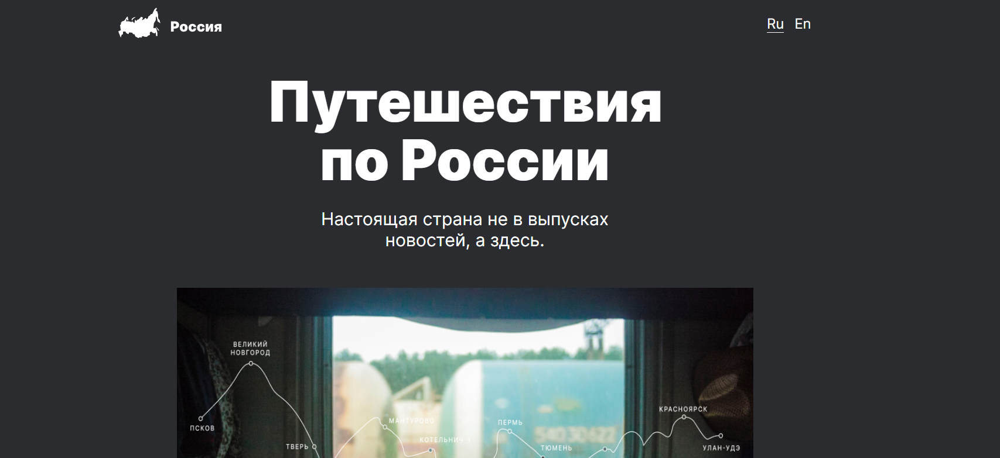

# Проект: Путешествие по России

## О проекте

Проект содержит небольшие стать, фотоподборку и интересные маршруты. Реализован без подключения сторонних библиотек и JS, адаптирован под экраны различных устройств с брейкпоинтами 320px, 768px, 1024px, 1280px. При создании использовались флексбоксы, гриды, медиазапросы, позиционирование. Файловая структура оформлена по БЭМ. Для соответствия проекта макету использовался Pixel perfect.

### Стек:
* HTML
* CSS
* Grid layout
* БЭМ
* Pixel perfect

Макет предоставлен: _Я.Практикум_.

[Ссылка на проект в GH Pages](https://dariy-iva.github.io/russian-travel/)
